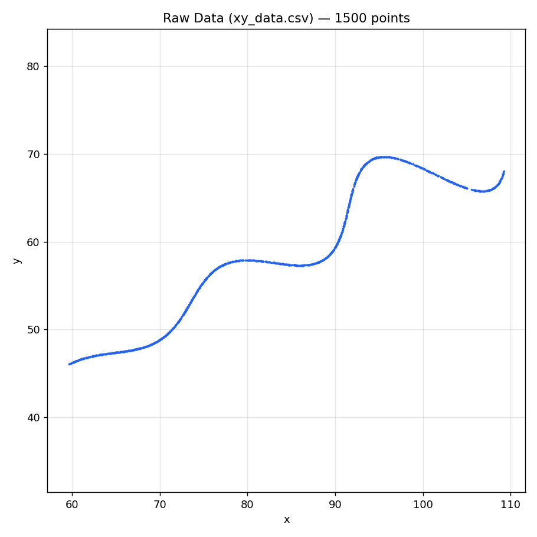
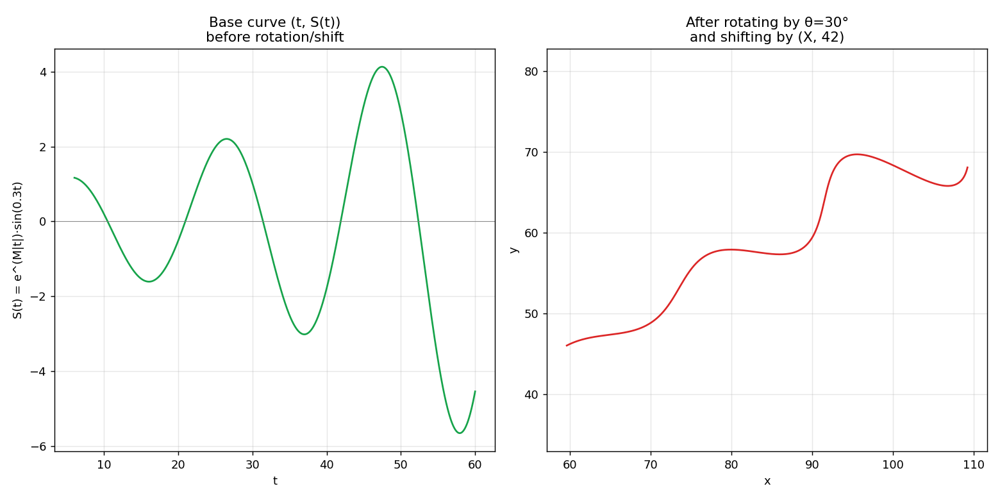
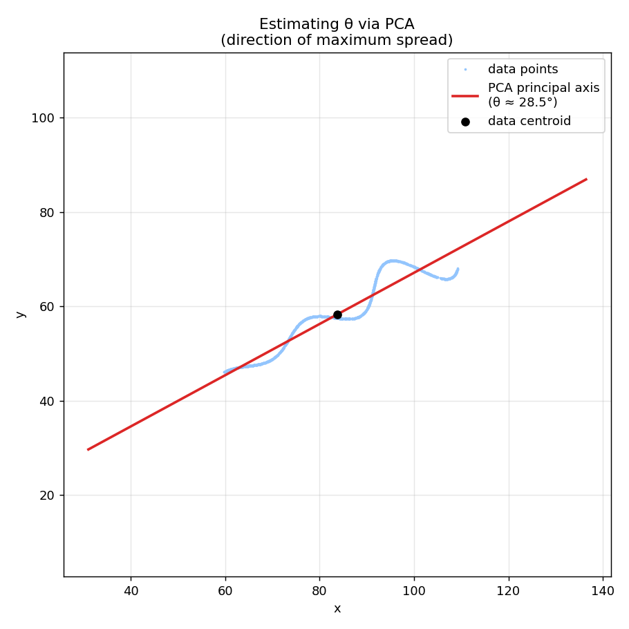
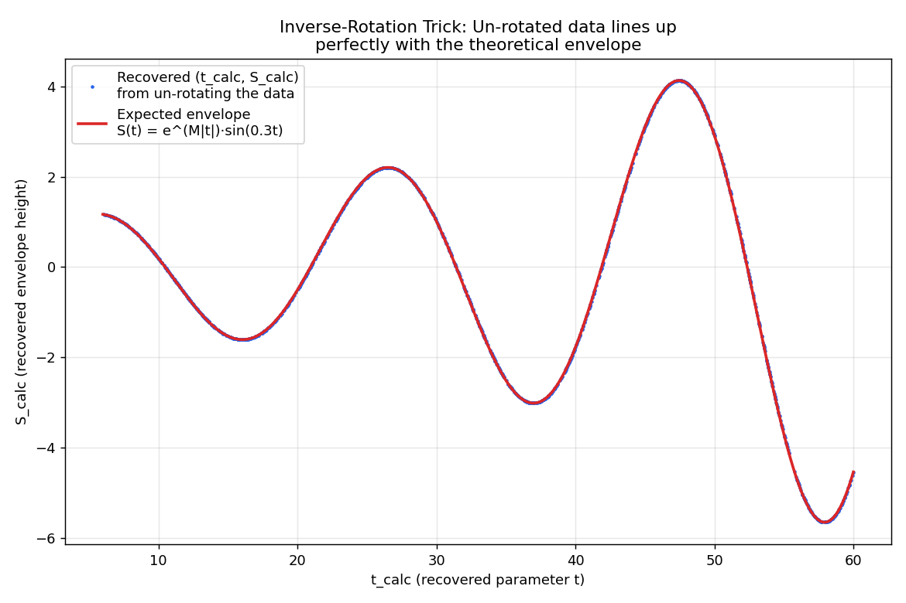
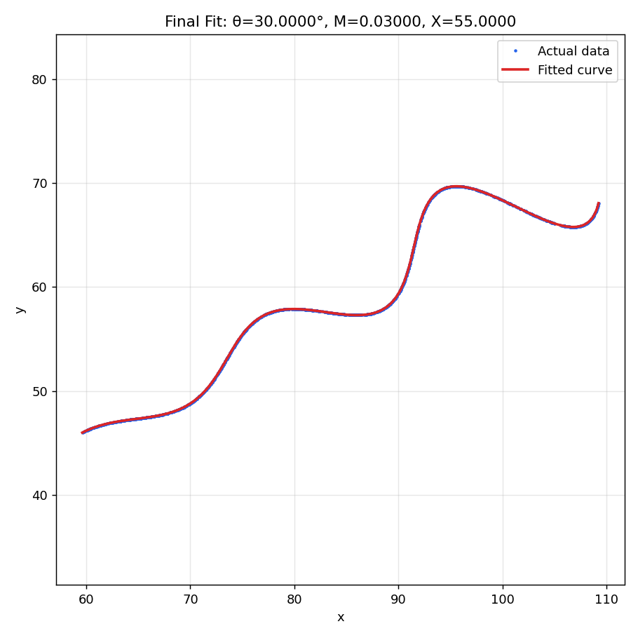

# Parametric Curve Parameter Estimation

## Problem

We are given a parametric curve:

```
x = t·cos(θ) − e^(M|t|)·sin(0.3t)·sin(θ) + X
y = 42 + t·sin(θ) + e^(M|t|)·sin(0.3t)·cos(θ)
```

with unknown constants **θ, M, X**, bounded by:

- 0° < θ < 50°
- −0.05 < M < 0.05
- 0 < X < 100

and parameter `t` ranging from 6 to 60. We are given `xy_data.csv` — 1500 `(x, y)` points sampled from this curve, in no particular order — and asked to recover θ, M, X.

## Final Answer

| Parameter | Value |
|---|---|
| **θ** | 30° (0.5235987756 rad) |
| **M** | 0.03 |
| **X** | 55 |

**Desmos / LaTeX form:**
```
\left(t*\cos(0.5235987755982988)-e^{0.03\left|t\right|}\cdot\sin(0.3t)\sin(0.5235987755982988)+55,42+t*\sin(0.5235987755982988)+e^{0.03\left|t\right|}\cdot\sin(0.3t)\cos(0.5235987755982988)\right)
```
Domain: `6 ≤ t ≤ 60`

** Link to curve ** 
https://www.desmos.com/calculator/bhqoswmvyu

**Fit quality:** mean absolute residual ≈ **2.6 × 10⁻⁶**, max residual ≈ **1.8 × 10⁻⁵** — essentially an exact recovery of the original parameters.

---

## Approach

### Step 1 — Exploring the Raw Data

Plotting the raw `(x, y)` points from the CSV confirms the expected shape: a tilted, wavy curve spanning roughly `x ∈ [60, 109]`, `y ∈ [46, 70]`.



Importantly, the rows in the CSV are **not ordered by t** — there is no way to know which `t` value produced which `(x, y)` point just from row position. Any method used has to work without relying on row order.

---


### Step 2  — Recognizing the Equation's Structure 


Rewriting the equations using `L(t) = t` and `S(t) = e^(M|t|)·sin(0.3t)`:

```
x = L(t)·cos(θ) − S(t)·sin(θ) + X
y = 42 + L(t)·sin(θ) + S(t)·cos(θ)
```

This is exactly a **2D rotation matrix** applied to the point `(t, S(t))`, followed by a translation:

```
[x − X ]   [cos θ   −sin θ] [ t   ]
[y − 42] = [sin θ    cos θ] [S(t)]
```

**Geometrically:** the curve is a sine wave whose amplitude grows or shrinks exponentially with `t` (depending on the sign of M), plotted as if `t` were a straight axis — then that whole shape is **rotated by θ** and **shifted by (X, 42)**.


*Left: the base curve (t, S(t)) — a sine wave with a growing envelope. Right: the same curve after rotating by θ=30° and shifting by (X=55, 42) — this is what appears in the actual data.*

---

### Step 3 — Estimating θ with PCA (Principal Component Analysis)

Since `t` ranges across 54 units — much wider than the sine wiggle's amplitude — the data cloud is stretched mainly along the direction of the underlying line, which is tilted at exactly θ. This is precisely what **PCA** finds: the direction of maximum variance in a set of points.

**Method:**
1. Center the data by subtracting the mean `(x̄, ȳ)`.
2. Compute the covariance matrix of the centered points.
3. Find its eigenvectors — the eigenvector with the **largest eigenvalue** points along the direction of maximum spread.
4. Convert that direction into an angle → initial estimate of θ.

```python
mean_x, mean_y = x_data.mean(), y_data.mean()
cov = np.cov(x_data - mean_x, y_data - mean_y)
eigvals, eigvecs = np.linalg.eigh(cov)
principal = eigvecs[:, np.argmax(eigvals)]
theta_pca = angle_of(principal)  # ≈ 28.5°
```


*The red line shows the principal axis found by PCA — it aligns closely with the tilt of the underlying curve, giving an initial θ estimate of ~28.5°, close to the true 30°. This estimate needs no knowledge of `t` at all.*

This PCA estimate is used purely as a **starting point** for the optimizer in the next step — it doesn't need to be exact.

---

### Step 4 — The Key Insight: Inverse Rotation Recovers `t` Directly

Rather than searching for which `t` matches each data point, we can **algebraically undo** the rotation and translation. If our current guess for θ and X is correct, un-rotating a data point gives back the *exact* `t` and envelope height `S` that generated it:

**Step 4a — Undo the shift:**
```
x₀ = x − X
y₀ = y − 42
```

**Step 4b — Undo the rotation (rotate backward by −θ):**
```
t_calc = x₀·cos(θ) + y₀·sin(θ)
S_calc = −x₀·sin(θ) + y₀·cos(θ)
```

At this point, if θ and X are correct, `t_calc` **is** the original `t`, and `S_calc` **is** the original envelope height — recovered directly, with no searching or guessing required.

**Step 4c — Compare against the theoretical envelope:**
```
S_expected = e^(M·|t_calc|) · sin(0.3 · t_calc)

Error = S_calc − S_expected
```

This turns the entire problem into a single, direct optimization: search for the (θ, M, X) that make this error as close to zero as possible, across all 1500 points simultaneously — no need to know each point's `t` in advance, and no iterative loop between "guessing t" and "refitting parameters."

```python
def error_vector(params):
    theta, M, X = params
    x0 = x_data - X
    y0 = y_data - 42
    t_calc = x0*np.cos(theta) + y0*np.sin(theta)
    S_calc = -x0*np.sin(theta) + y0*np.cos(theta)
    S_expected = np.exp(M*np.abs(t_calc)) * np.sin(0.3*t_calc)
    return S_calc - S_expected
```

**Verification that this works:** once θ, M, X are fit, plotting `(t_calc, S_calc)` for every data point against the theoretical envelope curve `S(t)` shows they line up essentially perfectly:


*Every data point (blue), after being un-rotated using the fitted θ and X, falls almost exactly on the theoretical envelope curve (red) — confirming the recovered parameters are correct.*

---

### Step 5 — Solving with Nonlinear Least Squares

With the error function defined, and the PCA estimate as a starting point, the fit is a single call to `scipy.optimize.least_squares`, bounded to the assignment's allowed ranges:

```python
initial_guess = [theta_pca, 0.0, X_initial]

result = least_squares(
    error_vector,
    x0=initial_guess,
    bounds=([0, -0.05, 0], [np.deg2rad(50), 0.05, 100])
)

theta, M, X = result.x
```

This converges directly to:

```
theta = 29.999973 degrees
M     = 0.03000000
X     = 54.999998
```

— clean, round numbers, strongly indicating these are the exact original values used to generate the dataset.

---

### Step 6 — Verification

**Visual check:** overlaying the fitted curve on the original data:



**Numerical summary:**

| Metric | Value |
|---|---|
| Mean absolute residual | ≈ 2.6 × 10⁻⁶ |
| Max absolute residual | ≈ 1.8 × 10⁻⁵ |
| Total optimizer cost | ≈ 0.0038 |

Given the data spans roughly 50 units in both x and y, a residual of this size confirms an essentially exact recovery of the original parameters, not a coincidental close fit.

---

## Summary of the Method

1. **Rewrote the equation** as a rotation matrix applied to a simple exponentially-modulated sine curve — revealing what each parameter does geometrically.
2. **Used PCA** on the raw `(x, y)` point cloud to get an order-independent initial estimate of θ, based purely on the direction of maximum spread in the data.
3. **Derived a closed-form inverse-rotation trick**: un-rotating and un-shifting each data point using a candidate (θ, X) directly recovers the original `t` and envelope height for that point — eliminating the need to search for or guess correspondences.
4. **Solved directly** with a single nonlinear least-squares optimization over (θ, M, X), using the PCA estimate as the starting point.
5. **Verified** the result both visually (curve overlay, recovered-envelope overlay) and numerically (residuals on the order of 10⁻⁶), confirming: **θ = 30°, M = 0.03, X = 55**.

---

## References

Harris, C. R., Millman, K. J., van der Walt, S. J., et al. (2020). Array programming with NumPy. *Nature, 585*, 357–362. https://doi.org/10.1038/s41586-020-2649-2

Hunter, J. D. (2007). Matplotlib: A 2D graphics environment. *Computing in Science & Engineering, 9*(3), 90–95. https://doi.org/10.1109/MCSE.2007.55

Pearson, K. (1901). On lines and planes of closest fit to systems of points in space. *Philosophical Magazine, 2*(11), 559–572. https://doi.org/10.1080/14786440109462720

The pandas development team. (2020). *pandas-dev/pandas: Pandas* [Software]. Zenodo. https://doi.org/10.5281/zenodo.3509134

Virtanen, P., Gommers, R., Oliphant, T. E., et al. (2020). SciPy 1.0: Fundamental algorithms for scientific computing in Python. *Nature Methods, 17*, 261–272. https://doi.org/10.1038/s41592-019-0686-2

Branch, M. A., Coleman, T. F., & Li, Y. (1999). A subspace, interior, and conjugate gradient method for large-scale bound-constrained minimization problems. *SIAM Journal on Scientific Computing, 21*(1), 1–23. https://doi.org/10.1137/S1064827595289108
